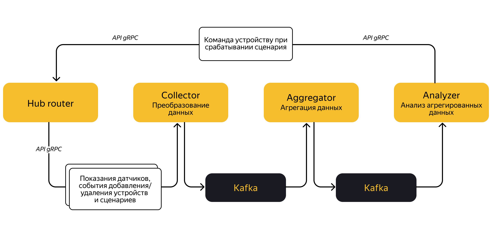

Проект платформы для анализа телеметрии
Smart Home Technologies. Проект специализируется обслуживании умных устройств — датчиков движения, освещённости и температуры.
Вам необходимо создать платформу, которая анализирует телеметрию. Такая платформа:
1) обрабатывает данные со всех проданных датчиков;
2) трансформирует их в нужный формат;
3) хранит описание сценариев: какую команду запустить и при каких показателях от конкретных датчиков;
определяет необходимость запуска этих сценариев.
Задача — реализовать несколько микросервисов, которые обрабатывают и передают данные через gRPC и Kafka и хранят информацию в БД PostgreSQL.
Реализовывать проект вы будете поэтапно: от микросервиса, который принимает данные датчиков, до всего приложения целиком.
Описание приложения
Приложение, над которым вы будете работать, представляет собой систему для сбора и анализа данных от датчиков умного дома. На вход подаются данные датчиков, а основная задача приложения — собрать эту информацию, обработать и определить, какие сценарии умного дома необходимо запустить.
Например, если поступил сигнал, что в комнате без света сработал датчик движения, то нужно включить конкретную лампочку.
Приложение будет состоять из нескольких микросервисов:
Hub router. Хаб — это устройство, которое пользователь устанавливает у себя дома. К нему присоединяются остальные датчики, приобретённые пользователем.

Датчик температуры, освещённости или умный выключатель — любой датчик, расположенный в пределах квартиры или дома, подключается к хабу по технологии Zigbee. Все они передают свои показания хабу, а хаб подключается к сети Интернет по Wi-Fi и отправляет данные в систему.

Данные от хабов пользователей принимает сервис Hub router. Он преобразует эти данные в понятные системе сообщения и направляет в другой сервис — Collector. В рамках проекта сервис Hub router уже реализован.
Collector. Принимает данные каждого пользовательского хаба, которые передаёт Hub router. Преобразовывает их в формат Apache Avro и сохраняет в топик Apache Kafka. Далее из этого топика данные могут считывать другие сервисы для своих нужд.
Aggregator. Считывает показания всех датчиков из топика Kafka и агрегирует по признаку принадлежности к хабу. Так получается снимок состояния всех датчиков, расположенных в пределах квартиры или дома. Результат агрегации записывается в топик Kafka.
Analyzer. Считывает агрегированное состояние датчиков в квартире или доме и проверяет, соответствует ли оно условиям какого-либо сценария для этого дома. Если состояние датчиков соответствует сценарию, то он запускается на выполнение, и Analyzer отправляет команды в Hub router. Hub router, в свою очередь, отправляет в нужный хаб указания выполнить конкретные действия.
Верхнеуровнево схема приложения выглядит так:

В этом техническом задании вам нужно реализовать сервис Collector, который получает данные от сервиса Hub router. Рассмотрим, что это за данные.
Устройства умного дома
Сейчас так много устройств, относящихся к технологиям «Умный дом». Настолько много, что их можно разделить на категории. Например, на такие:
Управление. Хабы и умные колонки.
Освещение. Умные лампочки, светильники и светодиодные ленты.
Электропитание. Умные розетки, реле и прочие устройства.
Безопасность. Датчики протечки, дыма, открытия, движения.
Техника. Роботы-пылесосы, умные чайники и холодильники.
Комфорт. Климатические датчики, умные системы кондиционирования и обогрева воздуха.
Компания Smart Home Technologies только выходит на рынок. Поэтому для начала остановились на ограниченном ассортименте устройств. Первые клиенты смогут выбирать из следующих категорий:
Управление. Пока тут будет только хаб. Но в ближайших планах — интеграция с лидерами рынка умных колонок, чтобы пользователи могли голосовыми командами управлять устройствами, подключёнными к хабу.
Освещение. В этой категории только лампы с ограниченной функциональностью. Они поддерживают только включение и отключение. Диммирование планируется реализовать позже.
Электропитание. Здесь есть и умные розетки, и переключатели. Они поддерживают изменение состояния на одно из двух возможных: «включено» и «выключено».
Безопасность. В этой категории только датчик движения.
Комфорт. Сюда относятся климатический датчик, датчик температуры и освещённости.
Все эти устройства связываются по протоколу Zigbee — технологии беспроводной передачи данных. Её основные достоинства: защищённость, высокая помехоустойчивость, низкое энергопотребление и возможность создания ячеистой топологии сети.
Это означает, что каждое устройство может быть не только источником собственных данных, но и ретранслятором чужих. Например, в загородном доме некоторые датчики могут быть сильно удалены от хаба и не иметь возможности прямого соединения с ним. Но если между ними и хабом есть другие Zigbee-устройства, то они могут передавать сигналы друг другу, двигаясь по цепочке до хаба.
Хаб — центральный контроллер. Он осуществляет отправку данных, полученных от устройств, в информационную систему компании. Также хаб предоставляет веб-интерфейс, с которым можно работать в браузере по домашней сети.
Таким образом, можно проверить текущее состояние датчиков, подключённых к хабу, настроить сценарии умного дома, зарегистрировать новые устройства и удалить старые. Также хаб получает команды управления устройствами от информационной системы умного дома и выполняет эти команды.
Все хабы взаимодействуют с сервисом Hub router. Коммуникация происходит по защищённому и оптимизированному бинарному протоколу, который был разработан специально для этих задач. Hub router запущен на серверах компании, у него есть доступ к внутренней защищённой VPN-сети, в которой работают остальные сервисы информационной системы умного дома.
Основная задача сервиса Hub router — это преобразование данных, полученных от хабов, из внутреннего, закрытого, формата в широко используемый. Он должен отправлять эти данные в информационную систему компании, скрытую за VPN.
Подытожим. Hub router работает со следующими данными:
События от устройств: показания измерений, выполненных датчиками, или события, которые сообщают об изменении состояния устройств.
События непосредственно от хабов: информация, которая поступает, когда пользователь через веб-интерфейс хаба добавил новый или удалил старый датчик или сценарий.
Рассмотрим подробнее эти категории событий.
События от устройств
У всех событий различных устройств есть общие признаки. Так, каждое активное устройство должно быть зарегистрировано в хабе, иначе им нельзя управлять.
Также у каждого устройства есть свой уникальный идентификатор. А любое событие — будь это очередное измерение температуры воздуха или выключение лампочки — происходит в определённый момент времени.
Выделим три характеристики всех устройство умного дома:
Идентификатор хаба, в котором зарегистрировано устройство.
Идентификатор самого устройства.
Таймстемп события.
Другие характеристики различаются для всех устройств. Например, климатический датчик оповестит об изменении температуры, об уровне влажности воздуха и о содержании углекислого газа. А умный выключатель может работать только с двумя состояниями: «включено» и «выключено».
Поэтому розетку, выключатель и светильник можно выделить в отдельную категорию устройств. А датчики температуры, движения, освещённости и климата будут отдельным типом устройств.
События хаба
Все устройства должны быть зарегистрированы в хабе. Следовательно, события их регистрации или удаления будут содержать идентификатор того хаба, к которому они относятся.
Сценарии автоматизации также можно создавать только в рамках устройств своего хаба. Поэтому они тоже будут содержать этот идентификатор. Как вы уже выяснили, любое событие происходит в определённый момент времени. Эти две характеристики будут общими для любого события хаба:
идентификатор хаба,
таймстемп события.
При регистрации в хабе нового устройства важными данными будут уникальный идентификатор устройства и его тип. В случае удаления устройства достаточно указать только его идентификатор.
При создании сценария нужно обязательно указать его название, которое придумывает пользователь. При помощи названия можно отличить один сценарий от другого. Это значит, что в рамках одного хаба (ведь сценарий создаётся для устройств, подключённых к конкретному хабу) названия сценариев не должны повторяться.
Чтобы удалить сценарий, помимо общих полей, достаточно указать его название. Однако для описания сценария нужно предоставить больше данных.
Сценарии умного дома
Сценарии позволяют объединить различные умные устройства и автоматизировать их работу. Например, сценарии помогают регулировать температуру воздуха, управляя работой обогревателя или кондиционера. Или экономить электричество, выключая свет, когда в помещении никого нет, или включать лампы, когда датчик фиксирует движение, а в помещении темно.
Чтобы система умного дома могла выполнить сценарий, она должна знать четыре вещи:
Какие устройства есть в распоряжении умного дома. Для этого нужен идентификатор хаба, ведь все устройства, прежде чем начать свою работу, должны быть подключены и зарегистрированы.
Название сценария. Идентификатор хаба и название сценария позволяют системе однозначно определить конкретный сценарий среди множества других.
Какие условия должны быть выполнены для активации сценария.
Какие действия нужно выполнить, когда сценарий активирован.
Рассмотрим подробнее условия и действия, которые нужны при работе сценария.
Условия
Мир системы умного дома состоит из подключённых к ней устройств. Показания этих устройств могут служить стимулом для выполнения определённых действий.
Система умного дома не может реагировать на абстрактные явления, если они не выражены в виде показаний датчиков или устройств. Поэтому условие должно опираться на данные, которые система получает от конкретных устройств, и содержать идентификаторы этих приборов.
Но и этого недостаточно. Важно учитывать ещё и тип показаний, для которого формируется условие. Ведь все устройства передают свои значения. Выключатели, например, сообщают, включён свет или выключен, а климатический датчик передаёт замеры температуры и влажности воздуха, уровень содержания углекислого газа.
Разные показания проверяются тоже по-разному. Для переключателя достаточно проверить, равны показатели требуемому состоянию или нет.
А вот для показаний интенсивности освещения, температуры, влажности нужно проверять не только соответствие конкретному значению. Тут важно учитывать величину показаний: меньше они или больше в сравнении с заданным значением. Это требование приводит вас прямиком к оператору сравнения: равно, больше или меньше.
А ещё в условии должно быть значение, с которым будут сравниваться показатели того или иного датчика. Все отметки доступных датчиков сводятся к целому числу или к логическим значениям true и false. При кодировании в бинарные форматы эти два типа нужно различать, так как кодирование логического значения может занимать намного меньше места.
Для передачи данных в формате JSON можно использовать просто числовой тип. В этом случае значение true можно заменить на 1, а false — на 0.
Таким образом, получим ключевые составляющие условий для сценариев умного дома:
Идентификатор устройства.
Тип сравниваемых показаний.
Тип операции сравнения.
Значение, с которым сравниваются показания.
Действия
После того как условия активации сценария определены, нужно сформулировать действия, которые должны быть выполнены. Как и в случае с условиями, действия будут ограничены доступными устройствами. То есть снова потребуются идентификаторы приборов умного дома.
Также датчики поддерживают различные действия. Поэтому при разработке нужно понимать, что именно нужно совершить. Например, умному пылесосу можно отправить команду включиться или выключиться. А уровень освещённости зависит от того, как ярко светит лампа: вечером интенсивность освещения можно перевести в значение 100%, а ночью снизить этот показатель до 40%. Здесь также нужно запомнить само значение, которое передаётся умному устройству.
Получаем такие ключевые составляющие, которые нужны для действий в сценариях умного дома:
Идентификатор устройства.
Тип действия.
Значение, если в качестве действия выбрана установка (например, уровень яркости, температура нагрева, скорость обдува и так далее).
Это верхнеуровневая архитектура будущей информационной системы, а также то, как происходит коммуникация между хабами, сервисами Hub router и Collector.